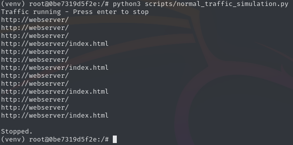
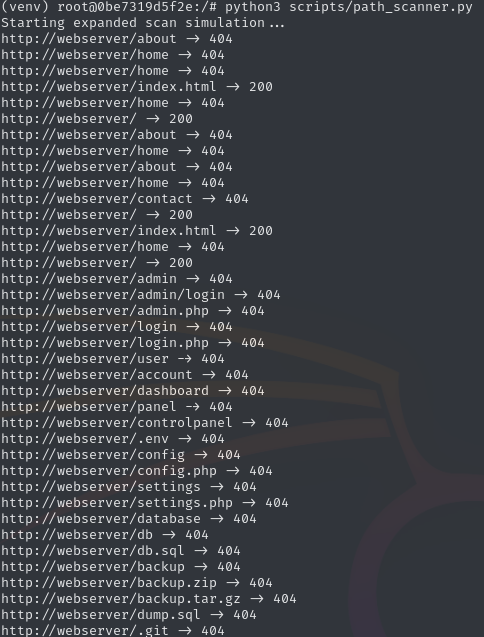
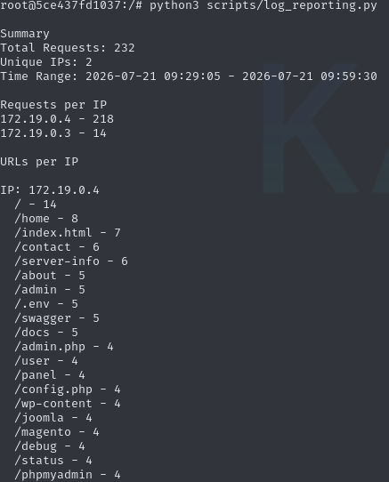
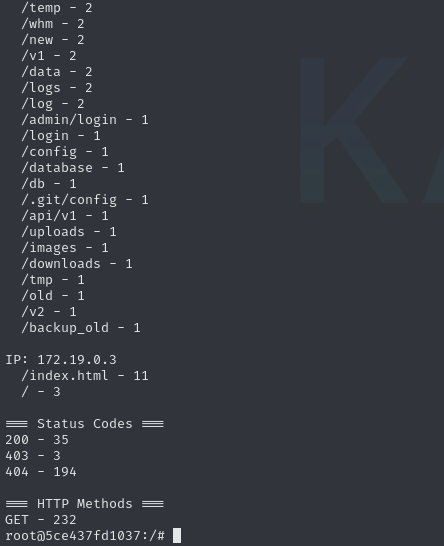
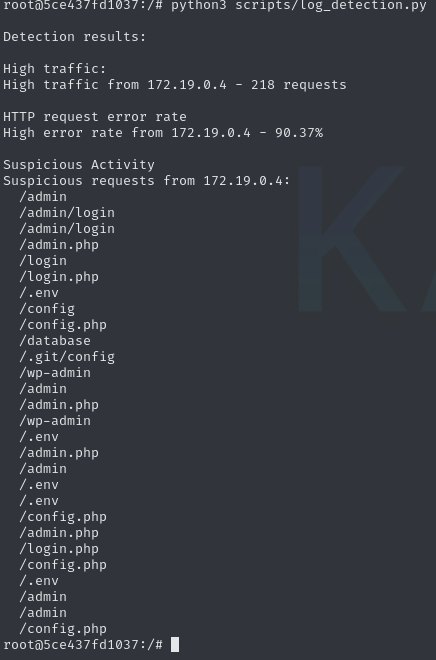

# Scripts

## Normal Traffic Script
Generates normal behavior requests every second to  http://webserver/ or http://webserver/index.html using the function requests.get() from the requests module.  
Stoppable pressing the Enter Key due to multithreading another wait for stop function.

## Path Scanner Script
Generates requests going to http://webserver with over 50 possible exploitable directories. The scanner shows the status code of these directories.

## Log Reporting Script
Generates summaries and statistics from log data by accessing the log data.  
Iterating over each log row and spliting it by spaces using line.split().  
Extracting the IP, Timestamp, Method, URL, and the Statuscode and saving it in a dictionary grouped by IP and per IP by url.  
Possible Filters: file, starttime, endtime, specific IP  

  

## Log Detection Script
Analyzes Apache access logs and identifies suspicious activity by extracting the IP, URL and Status Code of every log row.  
As detection data the script counts the total requests, error codes and suspicous URLs.  
The detection compares the IP Request counts with the configured treshold, calculates the error rate (threshold is over 50%) and compares the urls with the configured suspicious paths/urls configured in the code.  
Possible Filters: file and threshold for http error rate

